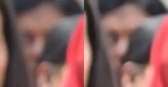

# FaceEnhancer

Face enhancement and restoration pipeline built using C++ and OpenCV.

This project improves facial image quality using denoising, contrast enhancement, sharpening, and seamless blending techniques while generating visual before-and-after comparisons.

---

## Demo

🎥 [Watch Demo Video](https://github.com/atulsharma47/FaceEnhancer/raw/main/assets/demo.mp4)

---

## Preview

### Before vs Enhanced Output

<p align="center">
  
</p>

---

## Key Features

- Face detection using Haar Cascades
- Noise reduction and image cleanup
- CLAHE-based contrast enhancement
- Sharpening and detail improvement
- Seamless face blending
- Batch image enhancement
- Before-and-after comparison generation
- Automated demo video creation

---

## Tech Stack

| Technology | Purpose |
|---|---|
| C++ | Core application logic |
| OpenCV | Image processing and computer vision |
| CMake | Build configuration |

---

## Enhancement Pipeline

```text
Input Image
   ↓
Face Detection
   ↓
Noise Reduction
   ↓
Contrast Enhancement
   ↓
Detail Sharpening
   ↓
Seamless Blending
   ↓
Enhanced Output
```

---

## Project Structure

```text
FaceEnhancer/
│
├── assets/
│   ├── demo.mp4
│   └── paired_face-*.png
│
├── images/
├── models/
│   └── haarcascade_frontalface_default.xml
│
├── output/
├── scripts/
│   └── make_demo.ps1
│
├── src/
│   └── main.cpp
│
├── CMakeLists.txt
├── README.md
└── .gitignore
```

---

## How It Works

The application processes facial images through multiple enhancement stages:

1. Detects facial regions using OpenCV Haar Cascades
2. Applies denoising to reduce image artifacts
3. Enhances contrast using CLAHE
4. Sharpens facial details
5. Blends enhanced regions seamlessly into the original image
6. Generates paired comparison outputs automatically

---

## Build Instructions

### Using CMake

```bash
mkdir build
cd build
cmake ..
cmake --build .
```

---

## Usage

Run the executable:

```bash
FaceEnhancer.exe
```

Place input images inside:

```text
images/
```

Enhanced results are generated inside:

```text
output/
```

---

## Example Outputs

<p align="center">
  
</p>

<p align="center">
  
</p>

---

## Future Improvements

- Real-time webcam enhancement
- GPU acceleration
- Deep learning-based restoration
- Video enhancement pipeline
- Desktop GUI application

---

## Author

Atul Sharma

GitHub: https://github.com/atulsharma47
